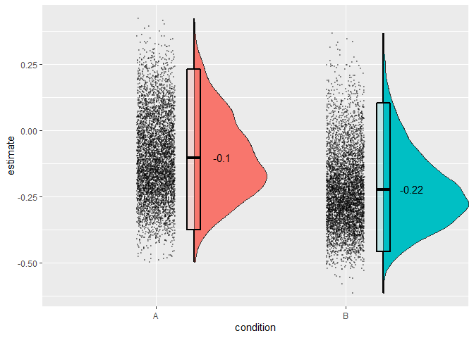

<!-- README.md is generated from README.Rmd. Please edit that file -->


[](https://cran.r-project.org/package=splithalf)
[](https://cran.r-project.org/package=splithalf)

# splithalf: robust estimates of split half reliability

The `R` package **splithalf** provides tools to estimate the internal
consistency reliability of cognitive measures. In particular, the tools
were developed for application to tasks that use difference scores as
the main outcome measure, for instance the Stroop score or dot-probe
attention bias index (average RT in incongruent trials minus average RT
in congruent trials).

The methods in **splithalf** are built around split half reliability
estimation. To increase the robustness of these estimates, the package
implements a permutation approach that takes a large number of random
(without replacement) split halves of the data. For each permutation the
correlation between halves is calculated, with the Spearman-Brown
correction applied (Spearman 1904). This process generates a
distribution of reliability estimates from which we can extract summary
statistics (e.g. average and 95% HDI).

### Why should I estimate the reliabilty of my task measurement?

while many cognitive tasks yield robust effects (e.g. everybody shows a
Stroop effect) they may not yield reliable individual differences
(Hedge, Powell, and Sumner 2018). As these measures are used in
questions of individual differences researchers need to have some
psychometric information for the outcome measures. Recently, it was
proposed that psychological science should set a standard expectation
for the reporting of reliability information for cognitive and
behavioural measures (2019). **splithalf** was developed to support this
proposition by providing a tool to easily extract internal consistency
reliability estimates from behavioural measures.

## Installation

The latest release version (`0.7.2` unofficial version name: Kitten
Mittens) can be installed from CRAN:

``` r
install.packages("splithalf")
```

The current developmental version can be installed from Github with:

``` r
devtools::install_github("sdparsons/splithalf")
```

**splithalf** requires the **tidyr** (Wickham and Henry 2019) and
**dplyr** (Wickham et al. 2018) packages for data handling within the
functions. The **robustbase** package is used to extract median scores
when applicable. The computationally heavy tasks (extracting many random
half samples of the data) are written in `c++` via the `R` package
**Rcpp** (Eddelbuettel et al. 2018). Figures use the **ggplot** package
(Wickham 2016), raincloud plots use code adapted from Allen et al.
(Allen et al. 2019), and the **patchwork** package (Pedersen 2019) is
used for plotting the multiverse analyses.

### Citing the package

Citing packages is one way for developers to gain some recognition for
the time spent maintaining the work. I would like to keep track of how
the package is used so that I can solicit feedback and improve the
package more generally. This would also help me track the uptake of
reporting measurement reliability over time.

Please use the following reference for the code: Parsons, Sam (2020):
splithalf: robust estimates of split half reliability. figshare.
Software. <https://doi.org/10.6084/m9.figshare.11956746.v4>

### User feedback

Developing the splithalf package is a labour of love (and occasionally
burning hatred). If you have any suggestions for improvement, additional
functionality, or anything else, please contact me
(sam.parsons@psy.ox.ac.uk) or raise an issue on github
(<https://github.com/sdparsons/splithalf>). Likewise, if you are having
trouble using the package (e.g. scream fits at your computer screen –
we’ve all been there) do contact me and I will do my best to help as
quickly as possible. These kind of help requests are super welcome. In
fact, the package has seen several increases in performance and
usability due to people asking for help.

## Latest update:

**Now on github and submitted to CRAN: VERSION 0.7.2 \[unofficial
version name: “Kitten Mittens”\]** Featuring reliability multiverse
analyses!!!

This update includes the addition of reliability multiverse functions. A
*splithalf* object can be inputted into *splithalf.multiverse* to
estimate reliability across a user-defined list of data-processing
specifications (e.g. min/max RTs). Then, because sometimes science is
more art than science, the multiverse output can be plotted with
*multiverse.plot*. A brief tutorial can be found below, and a more
comprehensive one can be found in a recent preprint (Parsons 2020).

Additionally, the output of splithalf has been reworked. Now a list is
returned including the specific function calls, the processed data.

Since version 0.6.2 a user can also set `plot = TRUE` in *splithalf* to
generate a raincloud plot of the distribution of reliability estimates.

## Examples

### A note on terminology used in this document

It is important that we have a similar understanding of the terminology
I use in the package and documentation. Each is also discussed in
reference to the functions later in the documentation.

-   Trial – whatever happens in this task, e.g. a stimuli is presented.
    Importantly, participants give one response per trial
-   Trial type – often trials can be split into different trial types
    (e.g. to compare congruent and incongruent trials)
-   Condition - this might be different blocks of trials, or something
    to be assessed separately within the functions. e.g. a task might
    have a block of ‘positive’ trials and a block of ‘negative’ trials.
-   Datatype - I use this to refer to the outcome of interest.
    specifically whether one is interested in average response times or
    accuracy rates
-   Score - I use score to indicate how the final outcome is measured;
    e.g. the average RT, or the difference between two average RTs, or
    even the difference between two differences between two RTs (yes,
    the final one is confusing)

### A note on preprocessing

The core function *splithalf* requires that the input dataset has
already undergone preprocessing (e.g. removal of error trials, RT
trimming, and participants with high error rates). Splithalf should
therefore be used with the same data that will be used to calculate
summary scores and outcome indices. The exception is in multiverse
analyses, as described below.

For those unfamiliar with R, the following snippets may help with common
data-processing steps. I also highly recommend the Software Carpentry
course “R for Reproducible Scientific Analysis”
(<https://swcarpentry.github.io/r-novice-gapminder/>).

Note == indicates ‘is equal to,’ :: indicates that the function uses the
package indicated, in the first case the **dplyr** package (Wickham et
al. 2018).

``` r
dataset %>%    
filter(accuracy == 1) %>%       ## keeps only trials in which participants made an accurate response
filter(RT >= 100, RT <= 2000)  %>%   ## removes RTs less than 100ms and greater than 2000ms
filter(participant != c(“p23”, “p45”)    ## removes participants “p23” and “p45”
```

If following rt trims you also trimmed by SD, use the following as well.
Note that this is for two standard deviations from the mean, within each
participant, and within each condition and trialtype.

``` r
dataset %>%    
    dplyr::group_by(participant, condition, compare) %>%
    dplyr::mutate(low =  mean(RT) - (2 * sd(RT)),
                  high = mean(RT) + (2 * sd(RT))) %>%
    dplyr::filter(RT >= low & RT <= high)
```

If you want to save yourself effort in running splithalf, you could also
rename your variable (column) names to the function defaults using the
following

``` r
dplyr::rename(dataset,
              RT = "latency",
              condition = FALSE,
              participant = "subject",
              correct = "correct",
              trialnum = "trialnum",
              compare = "congruency")
```

The following examples assume that you have already processed your data
to remove outliers, apply any RT cutoffs, etc. A reminder: the data you
input into *splithalf* should be the same as that used to create your
final scores - otherwise the resultant estimates will not accurately
reflect the reliability of your data.

### Questions to ask before running splithalf

These questions should feed into what settings are appropriate for your
need, and are aimed to make the *splithalf* function easy to use.

1.  **What type of data do you have?**

Are you interested in response times, or accuracy rates?

Knowing this, you can set `outcome = "RT"`, or `outcome = "accuracy"`

2.  **How is your outcome score calculated?**

Say that your response time based task has two trial types;
“incongruent” and “congruent.” When you analyse your data will you use
the average RT in each trial type, or will you create a difference score
(or bias) by e.g. subtracting the average RT in congruent trials from
the average RT in incongruent trials. The first can be called with
`score = "average"` and the second with `score = "difference"`.

3.  **Which method would you like to use to estimate (split-half)
    reliability?**

A super common way is to split the data into odd and even trials.
Another is to split by the first half and second half of the trials.
Both approaches are implemented in the *splithalf* funciton. However, I
believe that the permutation splithalf approach is the most applicable
in general and so the default is `halftype = "random"`

### An example dataset

For this brief example, we will simulate some data for 60 participants,
who each completed a task with two blocks (A and B) of 80 trials. Trials
are also evenly distributed between “congruent” and “incongruent”
trials. For each trial we have RT data, and are assuming that
participants were accurate in all trials.

``` r
n_participants = 60 ## sample size
n_trials = 80
n_blocks = 2

sim_data <- data.frame(participant_number = rep(1:n_participants, each = n_blocks * n_trials),
                       trial_number = rep(1:n_trials, times = n_blocks * n_participants),
                       block_name = rep(c("A","B"), each = n_trials, length.out = n_participants * n_trials * n_blocks),
                       trial_type = rep(c("congruent","incongruent"), length.out = n_participants * n_trials * n_blocks),
                       RT = rnorm(n_participants * n_trials * n_blocks, 500, 200),
                       ACC = 1)
```

### Difference scores

This is by far the most common outcome measure I have come across, so
lets start with that.

Our data will be analysed so that we have two ‘bias’ or ‘difference
score’ outcomes. So, within each block, we will take the average RT in
congruent trials and subtract the average RT in incongruent trials.
Calculating the final scores for each participant and for each block
separately could be done as follows:

``` r
library("dplyr")
library("tidyr")

sim_data %>%
  group_by(participant_number, block_name, trial_type) %>%
  summarise(average = mean(RT)) %>%
  spread(trial_type, average) %>%
  mutate(bias = congruent - incongruent)
# A tibble: 120 x 5
# Groups:   participant_number, block_name [120]
   participant_number block_name congruent incongruent     bias
                <int> <fct>          <dbl>       <dbl>    <dbl>
 1                  1 A               511.        512.   -0.692
 2                  1 B               470.        493.  -23.7  
 3                  2 A               535.        471.   63.1  
 4                  2 B               475.        588. -113.   
 5                  3 A               538.        497.   40.8  
 6                  3 B               482.        548.  -66.6  
 7                  4 A               471.        491.  -20.4  
 8                  4 B               464.        429.   35.1  
 9                  5 A               492.        488.    4.48 
10                  5 B               537.        570.  -33.6  
# ... with 110 more rows
```

To estimate reliability with *splithalf* we run the following.

``` r
library("splithalf")

difference <- splithalf(data = sim_data,
                        outcome = "RT",
                        score = "difference",
                        conditionlist = c("A", "B"),
                        halftype = "random",
                        permutations = 5000,
                        var.RT = "RT",
                        var.condition = "block_name",
                        var.participant = "participant_number",
                        var.compare = "trial_type",
                        compare1 = "congruent",
                        compare2 = "incongruent",
                        average = "mean",
                        plot = TRUE)
```

      condition  n splithalf 95_low 95_high spearmanbrown SB_low SB_high
    1         A 60     -0.04  -0.21    0.15         -0.07  -0.35    0.26
    2         B 60     -0.05  -0.23    0.13         -0.09  -0.37    0.23

Specifying `plot = TRUE` will also allow you to plot the distributions
of reliability estimates. you can extract the plot from a saved object
with e.g. `difference$plot`.

<!-- -->

### Reading and reporting the output

The *splithalf* output gives estimates separately for each condition
defined (if no condition is defined, the function assumes that you have
only a single condition, which it will call “all” to represent that all
trials were included).

The second column (n) gives the number of participants analysed. If, for
some reason one participant has too few trials to analyse, or did not
complete one condition, this will be reflected here. I suggest you
compare this n to your expected n to check that everything is running
correctly. If the ns dont match, we have a problem. More likely, R will
give an error message, but useful to know.

Next are the estimates; the splithalf column and the associated 95%
percentile intervals, and the Spearman-Brown corrected estimate with its
own percentile intervals. Unsurprisingly, our simlated random data does
not yield internally consistant measurements.

*What should I report?* My preference is to report everything. 95%
percentiles of the estimates are provided to give a picture of the
spread of internal consistency estimates. Also included is the
spearman-brown corrected estimates, which take into account that the
estimates are drawn from half the trials that they could have been.
Negative reliabilities are near uninterpretable and the spearman-brown
formula is not useful in this case.

> We estimated the internal consitency of bias A and B using a
> permutation-based splithalf approach (Parsons 2019) with 5000 random
> splits. The (Spearman-Brown corrected) splithalf internal consistency
> of bias A was were *r*<sub>SB</sub> = -0.07, 95%CI \[-0.35,0.26\].
>
> — Parsons, 2020

### Average scores

For some tasks the outcome measure may simply be the average RT. In this
case, we will ignore the trial type option. We will extract separate
outcome scores for each block of trials, but this time it is simply the
average RT in each block. Note that the main difference in this code is
that we have omitted the inputs about what trial types to ‘compare,’ as
this is irrelevant for the current task.

``` r
average <- splithalf(data = sim_data,
                     outcome = "RT",
                     score = "average",
                     conditionlist = c("A", "B"),
                     halftype = "random",
                     permutations = 5000,
                     var.RT = "RT",
                     var.condition = "block_name",
                     var.participant = "participant_number",
                     average = "mean")
Warning in splithalf(data = sim_data, outcome = "RT", score = "average", :
var.trialnum will soon be depreciated
```

      condition  n splithalf 95_low 95_high spearmanbrown SB_low SB_high
    1         A 60     -0.15  -0.31    0.04         -0.25  -0.48    0.07
    2         B 60      0.05  -0.12    0.23          0.08  -0.22    0.38

### Difference-of-difference scores

The difference of differences score is a bit more complex, and perhaps
also less common. I programmed this aspect of the package initially
because I had seen a few papers that used a change in bias score in
their analysis, and I wondered “I wonder how reliable that is as an
individual difference measure.” Be warned, difference scores are nearly
always less reliable than raw averages, and differences-of-differences
will be less reliable again.

Our difference-of-difference variable in our task is the difference
between bias observed in block A and B. So our outcome is calculated
something like this.

BiasA = incongruent\_A - congruent\_A

BiasB = incongruent\_B - congruent\_B

Outcome = BiasB - BiasA

In our function, we specify this very similarly as in the difference
score example. The only change will be changing the score to
“difference\_of\_difference.” Note that we will keep the condition list
consisting of A and B. But, specifying that we are interested in the
difference of differences will lead the function to calculate the
outcome scores apropriately.

``` r
diff_of_diff <- splithalf(data = sim_data,
                        outcome = "RT",
                        score = "difference_of_difference",
                        conditionlist = c("A", "B"),
                        halftype = "random",
                        permutations = 5000,
                        var.RT = "RT",
                        var.condition = "block_name",
                        var.participant = "participant_number",
                        var.compare = "trial_type",
                        compare1 = "congruent",
                        compare2 = "incongruent",
                        average = "mean")
Warning in splithalf(data = sim_data, outcome = "RT", score =
"difference_of_difference", : var.trialnum will soon be depreciated
```

         condition  n splithalf 95_low 95_high spearmanbrown SB_low SB_high
    1 change score 60     -0.02   -0.2    0.17         -0.04  -0.33    0.29

## Multiverse analysis extension

This example is simplified from Parsons (2020). The process takes four
steps. First, specify a list of data processing decisions. Here, we’ll
specify only removing trials greater or lower than a specified amount.
More options are available, such as total accuracy cutoff thresholds for
participant removals.

``` r
specifications <- list(RT_min = c(0, 100, 200),
                       RT_max = c(1000, 2000),
                       averaging_method = c("mean", "median"))
```

Second, perform `splithalf(...)`. The key difference here is …

``` r
difference <- splithalf(data = sim_data,
                        outcome = "RT",
                        score = "difference",
                        conditionlist = c("A"),
                        halftype = "random",
                        permutations = 5000,
                        var.RT = "RT",
                        var.condition = "block_name",
                        var.participant = "participant_number",
                        var.compare = "trial_type",
                        var.ACC = "ACC",
                        compare1 = "congruent",
                        compare2 = "incongruent",
                        average = "mean")
Warning in splithalf(data = sim_data, outcome = "RT", score = "difference", :
var.trialnum will soon be depreciated
```

Third, perform `splithalf.multiverse` with the specification list and
splithalf objects as inputs

``` r
multiverse <- splithalf.multiverse(input = difference,
                                   specifications = specifications)
```

Finally, plot the multiverse with plot.multiverse.

``` r
multiverse.plot(multiverse = multiverse,
                title = "README multiverse")
```

<!-- -->

For more information, see Parsons (2020).

## Other considerations

### how many permutations?

To examine how many random splits are required to provide a precise
estimate, a short simulation was performed including 20 estimates of the
spearman-brown reliability estimate, for each of 1, 10, 50, 100, 1000,
2000, 5000, 10000, and 20000 random splits. This simulation was
performed on data from one block of 80 trials. Based on this simulation,
I recommend 5000 (or more) random splits be used to calculate split-half
reliability. 5000 permutations yielded a standard deviation of .002 and
a total range of .008, indicating that the reliability estimates are
stable to two decimal places with this number of random splits.
Increasing the number of splits improved precision, however 20000 splits
were required to reduce the standard deviation to .001.

### *splithalf* runtime?

The speed of *splithalf* rests entirely on the number of conditions,
participants, and permutations. The biggest factor will be your machine
speed. For relative times, I ran a simulation with a range of sample
sizes, numbers of conditions, numbers of trials, and permutations. The
data is contained within the package as `data/speedtest.csv`

<!-- -->

## Future development

The **splithalf** package is still under development. If you have
suggestions for improvements to the package, or bugs to report, please
raise an issue on github (<https://github.com/sdparsons/splithalf>).
Currently, I have the following on my immediate to do list:

-   error tracking
    -   I plan to develop a function that catches potential issues that
        could arise with the functions.
    -   I also plan to document common R warnings and errors that arise
        and why (as sometimes without knowing exactly how the functions
        work these issues can be harder to trace back).
-   include other scoring methods:
    -   signal detection, e.g. d prime
    -   potentially customisable methods, e.g. where the outcome is
        scored in formats similar to A - B / A + B

## Comparison to other software

**splithalf** is the only package to implement all of these tools, in
particular reliability multiverse analyses. Some other `R` packages
offer a bootstrapped approach to split-half reliability **multicon**
(Sherman 2015), **psych** (Revelle 2019), and **splithalfr** (Pronk
2020)

## References

<div id="refs" class="references csl-bib-body hanging-indent">

<div id="ref-allen_raincloud_2019" class="csl-entry">

Allen, Micah, Davide Poggiali, Kirstie Whitaker, Tom Rhys Marshall, and
Rogier A. Kievit. 2019. “Raincloud Plots: A Multi-Platform Tool for
Robust Data Visualization.” *Wellcome Open Research* 4 (April): 63.
<https://doi.org/10.12688/wellcomeopenres.15191.1>.

</div>

<div id="ref-R-Rcpp" class="csl-entry">

Eddelbuettel, Dirk, Romain Francois, JJ Allaire, Kevin Ushey, Qiang Kou,
Nathan Russell, Douglas Bates, and John Chambers. 2018. *Rcpp: Seamless
r and c++ Integration*. <https://CRAN.R-project.org/package=Rcpp>.

</div>

<div id="ref-hedge_reliability_2018" class="csl-entry">

Hedge, Craig, Georgina Powell, and Petroc Sumner. 2018. “The Reliability
Paradox: Why Robust Cognitive Tasks Do Not Produce Reliable Individual
Differences.” *Behavior Research Methods* 50 (3): 1166–86.
<https://doi.org/10.3758/s13428-017-0935-1>.

</div>

<div id="ref-R-splithalf" class="csl-entry">

Parsons, Sam. 2019. “Splithalf; Robust Estimates of Split Half
Reliability.” <https://doi.org/10.6084/m9.figshare.5559175.v5>.

</div>

<div id="ref-parsons_exploring_2020" class="csl-entry">

———. 2020. “Exploring Reliability Heterogeneity with Multiverse
Analyses: Data Processing Decisions Unpredictably Influence Measurement
Reliability.” Preprint, June. <https://doi.org/10.31234/osf.io/y6tcz>.

</div>

<div id="ref-parsons_kruijt_fox_2019" class="csl-entry">

Parsons, Sam, Anne-Wil Kruijt, and Elaine Fox. 2019. “Psychological
Science Needs a Standard Practice of Reporting the Reliability of
Cognitive Behavioural Measurements.” Advances in Methods; Practices in
Psychological Science.
<https://doi.org/doi.org/10.1177/2515245919879695>.

</div>

<div id="ref-R-patchwork" class="csl-entry">

Pedersen, Thomas Lin. 2019. *Patchwork: The Composer of Plots*.
<https://CRAN.R-project.org/package=patchwork>.

</div>

<div id="ref-R-splithalfr" class="csl-entry">

Pronk, Thomas. 2020. *Splithalfr: Extensible Bootstrapped Split-Half
Reliabilities*. <https://CRAN.R-project.org/package=splithalfr>.

</div>

<div id="ref-R-psych" class="csl-entry">

Revelle, William. 2019. *Psych: Procedures for Psychological,
Psychometric, and Personality Research*. Evanston, Illinois:
Northwestern University. <https://CRAN.R-project.org/package=psych>.

</div>

<div id="ref-R-multicon" class="csl-entry">

Sherman, Ryne A. 2015. *Multicon: Multivariate Constructs*.
<https://CRAN.R-project.org/package=multicon>.

</div>

<div id="ref-spearman_proof_1904" class="csl-entry">

Spearman, C. 1904. “The Proof and Measurement of Association Between Two
Things.” *The American Journal of Psychology* 15 (1): 72.
<https://doi.org/10.2307/1412159>.

</div>

<div id="ref-R-ggplot2" class="csl-entry">

Wickham, Hadley. 2016. *Ggplot2: Elegant Graphics for Data Analysis*.
Springer-Verlag New York. <https://ggplot2.tidyverse.org>.

</div>

<div id="ref-R-dplyr" class="csl-entry">

Wickham, Hadley, Romain François, Lionel Henry, and Kirill Müller. 2018.
*Dplyr: A Grammar of Data Manipulation*.
<https://CRAN.R-project.org/package=dplyr>.

</div>

<div id="ref-R-tidyr" class="csl-entry">

Wickham, Hadley, and Lionel Henry. 2019. *Tidyr: Tidy Messy Data*.
<https://CRAN.R-project.org/package=tidyr>.

</div>

</div>
